# DDC数据中心Kong网关安装配置说明


### 硬件要求：

最低配置：4核8G

建议配置：8核32G


### 预置条件：

redis   6.0.5+

docker 20.10.21+

docker-compose 1.25.5+


### 项目依赖说明：

kong：网关主程序

postgresql：网关数据库

konga：网关可视化配置web服务

kong-service：网关微服务

redis：网关接入Key认证和限流


### 安装启动：

克隆项目：

```shell
git clone https://github.com/BSN-DDC/ddc-kong-gateway.git
```

### 项目结构：

```shell
[root@localhost bsn]# tree -L 3 ddc-kong-gateway/
ddc-kong-gateway/
├── docker-compose.yaml
├── kong
│   ├── conf
│   │   ├── kong.conf
│   │   ├── kong.yaml
│   │   ├── nginx_kong.lua
│   │   ├── nginx_kong_stream.lua
│   │   └── start.sh
│   ├── logs
│   │   ├── access.log
│   │   ├── admin_access.log
│   │   ├── error.log
│   │   ├── status_error.log
│   │   ├── tcp_access.log
│   │   └── tcp_error.log
│   └── plugins
│       ├── access-key-auth-with-grpc
│       ├── access-key-auth-with-http
│       └── deck
└── ddc-kong-service
    ├── config
    │   └── config.yaml
    └── ddc-kong-service

8 directories, 15 files
```


依次授权ddc-kong-gateway/kong 、ddc-kong-gateway/ddc-kong-service文件夹可读/写/执行权限，执行：

```shell
chmod 777 -R ddc-kong-gateway/kong
chmod 777 -R ddc-kong-gateway/ddc-kong-service
```

修改微服务ddc-kong-service/config/config.yaml配置文件：

##### 微服务配置文件示例：

```shell
Redis:
  redisHost: localhost:6379    // redis IP+Port  需与下方插件配置一致
  redisPW: "password"		   // redis 密码   需与下方插件配置一致
  redisDb: 0				   // redis 库  需与下方插件配置一致
KeySymbol: "ddc"			   // redis存储key标识符，需与下方插件配置的标识符一致
ServerPort: 18899   		   // 微服务API端口号
```

docker-compose启动网关，执行：

```shell
docker network create kong-net                 // 仅首次运行时需要创建docker网络，用于容器之间内部通信
docker-compose -f docker-compose.yaml up -d    // 启用容器
// docker-compose -f docker-compose.yaml down  // 停止容器
```

导入网关初始化配置：

**该操作只需在网关第一次启动后进行，后续不用重新导入！**

进入kong网关容器：

```shell
docker exec -it ddc-kong bash

容器内运行：
cd /usr/local/kong/ && deck sync --config /usr/local/kong/kong.yaml
```

docker容器启动成功示例：

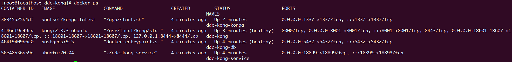


### 具体配置：

konga初始化配置，浏览器打开konga地址：

http://[Kong网关IP]:1337

注意：为了安全起见，1337端口不要对外开放访问

首次打开需要注册konga用户：

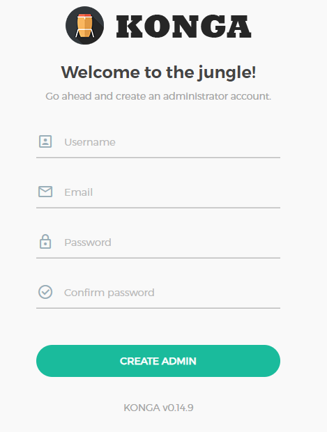

注册并登录成功后，配置kong网关的管理地址：

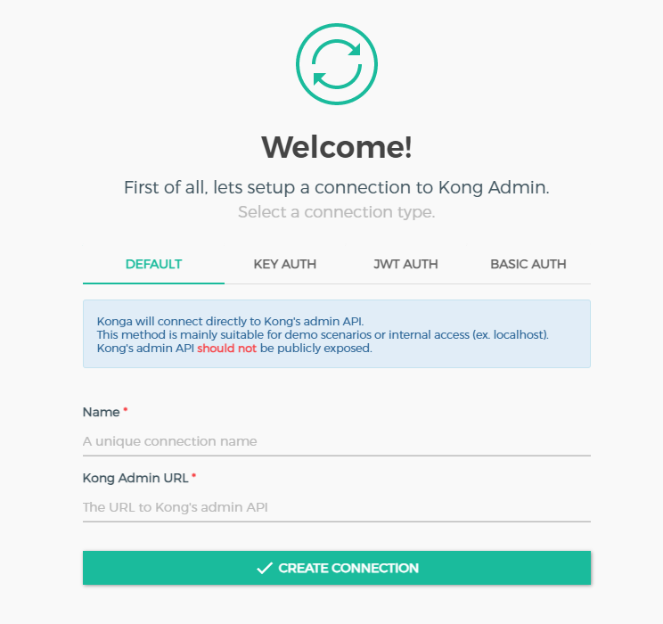

用户名称：admin（自定义）

地址：http://ddc-kong:8001

ddc-kong为kong网关容器名称，

8001为kong网关admin_api端口，

konga与kong之间通过docker内部虚拟网络通讯，

配置好即可连接到kong网关，管理配置网关，

因为之前有导入初始化网关配置，后续只需添加upstream配置和修改插件的配置，网关即可正常运行。


##### 1、upstream配置

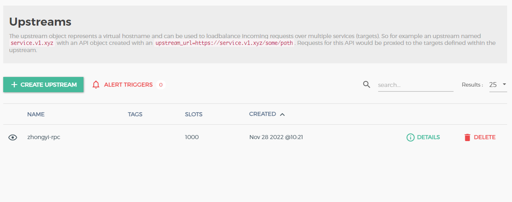

**upstream名称中的chainType 必须与用户请求path中的chainType 一致，否则不能正常转发交易！**

upstream名称格式为（全小写）：chainType + ”-“ + chainPort 

必须按照此格式配置,其他选项不做改动。

例如：zhongyi-rpc

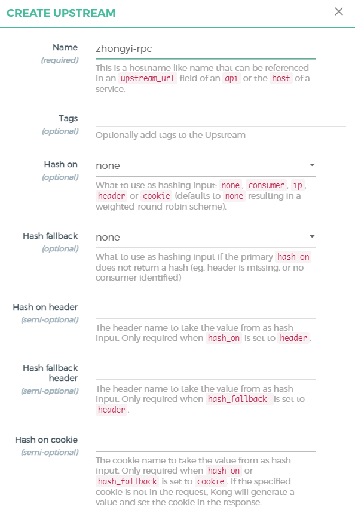

再配置upstream下的targets，格式为[IP:Port]

例如：192.168.1.100:3921

**targets至少需要配置一个，这是最终接受交易的节点地址。**

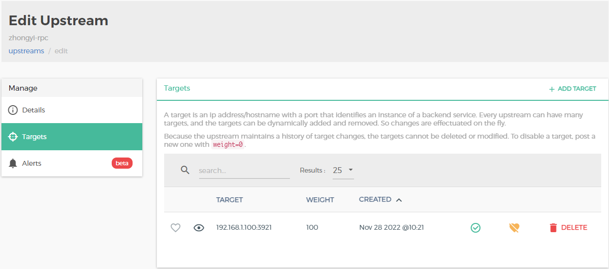


##### 2、插件配置

插件名称：access-key-auth-with-http

修改redis配置，需与微服务redis配置一致，

修改redis Key标识符，需与微服务标识符配置一致，

其他参数不做改动

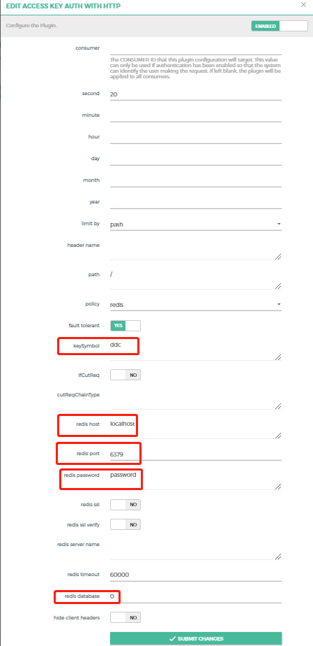


插件名称：access-key-auth-with-grpc

修改redis配置，需与微服务redis配置一致，

修改redis Key标识符，需与微服务标识符配置一致：

其他参数不做改动

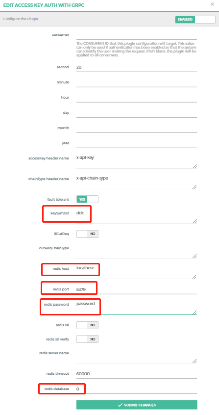


##### 3、Consumers 配置

创建用户并配置Basic Auth授权：

创建的用户名称与密码，需要配置到算力中心微服务nacos里的kong-gateway-config.yml文件里，运维系统请求网关微服务接口时使用。

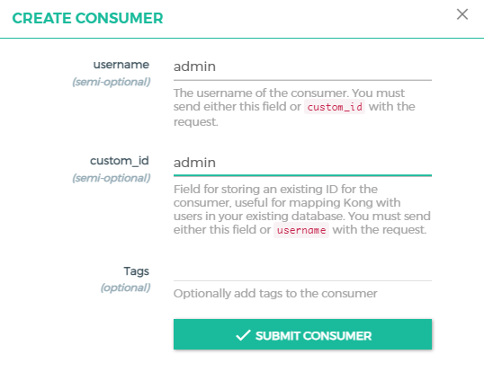


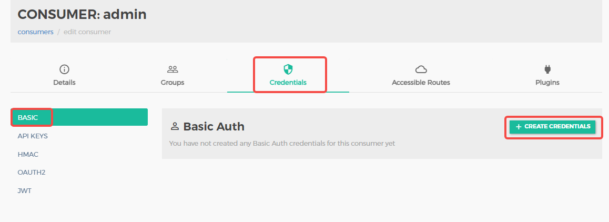

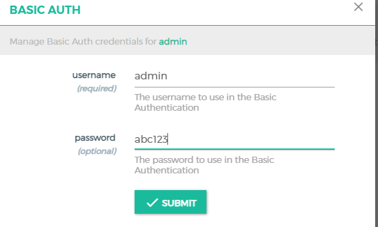

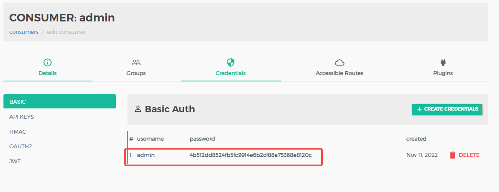


## 核心配置：

1、微服务中的redis配置需要与2个插件中的redis配置一致，否则不能正常认证和限流

2、对外公开的chainType名称要与upstream名称的第一段名称一致，否则不能正常转发到正确的目标节点

3、网关中创建的consumers中Basic Auth用户名与密码，需要配置到算力中心微服务nacos里的kong-gateway-config.yml文件里，否则运维系统不能请求网关微服务接口

4、为了网关安全性，kong网关相关的管理接口端口未对外开放端口，详见docker-compose文件，kong与konga、微服务之间的通信，通过docker的虚拟网络通信

5、kong网关官方开发者文档地址：https://docs.konghq.com/gateway/2.8.x/


### 网关对外开放端口说明：

18601：http/websocket端口

18602：https/websockets端口

18603：grpcs端口

18605：grpc端口


### 网关请求核心参数说明：

用户接入Key：accessKey

用户请求目标链：chainType

用户请求链接口类型：chainPort

#### 网关请求格式：

##### http请求类型：

https://[域名:端口]/api/[accessKey]/[chainType]/[chainPort]/[链上path]

*注*：链上path按需配置，可为空

例如：https://[域名:端口]/api/015416c06ef74ac38a92521792f97e7d/spartanone/rpc

##### websocket请求类型：

wss://[域名:端口]/api/[accessKey]/[chainType]/ws/[链上path]

*注*：链上path按需配置，可为空

例如：wss://[域名:端口]/api/015416c06ef74ac38a92521792f97e7d/spartanone/ws

##### grpc请求类型：

[域名:端口]

header配置：

x-api-key:[accessKey]

x-api-chain-type:[chainType]


### 验证步骤：

在数据中心方门户中获取网关接入信息，然后按格式请求网关接口，验证请求是否可以成功。

注意[accessKey]、[chainType]、[chainPort]的参数配置。


### 其他参考：

redis安装与配置：

github：https://github.com/redis/redis

官方文档：https://redis.io/docs/getting-started/
